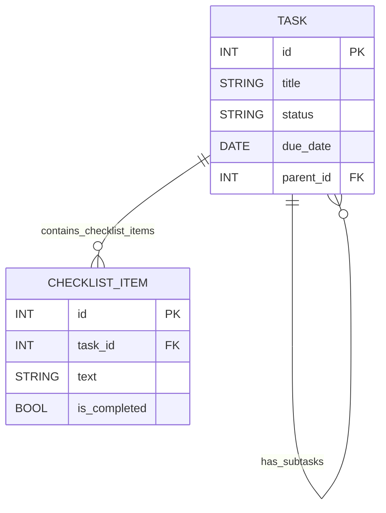
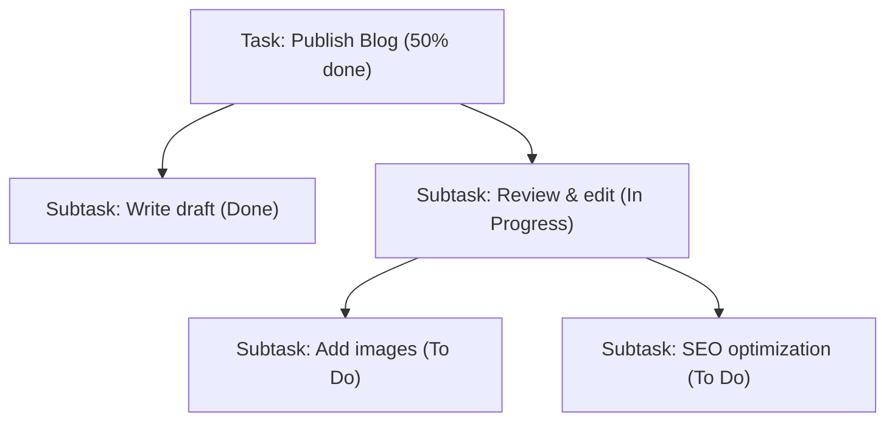

# Tracking & Progress – Subtasks vs Checklists

**Executive Summary:** Modern task apps support breaking work into subtasks (independent child tasks) or checklists (simple to-dos within a task). Subtasks are full-fledged tasks (with their own assignee, due dates, attachments, etc.), while checklists are lightweight item lists (often unassigned, no dependencies). The choice affects UX, data modeling, and progress tracking. We review common patterns, data models (relational and document examples), progress computation (simple counts vs weighted averages), time tracking roll-ups, permissions, synchronization, integrations, and more. A comparison of Asana, Trello, Jira, ClickUp, and Todoist illustrates how popular tools handle subtasks and checklists. This report includes an executive summary, detailed analysis, a comparison table, sample schemas, UI diagrams (mermaid), and example JSON payloads.

## Definitions: Subtasks vs Checklists

- **Subtask:** A child task linked to a parent. Behaves like an independent task with its own metadata (assignee, status, deadline, attachments). For example, _“subtasks function like independent tasks with all the same fields as a parent task”_ in Asana【17†L1-L4】. Subtasks are used when a piece of work needs separate tracking, assignment, or has its own deadline.
- **Checklist (or checklist item):** A simple todo-item under a task/card. Checklists are usually just title + checkbox (and sometimes notes), without full task fields. They are ideal for small steps that do not need separate due dates or assignees. For example, MeisterTask advises: _“Use a checklist when dealing with small, simple to-dos that don’t require a separate assignee or deadline. Use a subtask when the item is more complex and needs to be tracked independently”_【66†L28-L36】.

These concepts often overlap: some apps implement only subtasks (e.g. Asana), others have only checklists (e.g. Trello has no built-in “subtask” but checklists can be converted to cards), and others support both (e.g. ClickUp). Checklists are generally not included in roll-up progress by default (since they lack assigned work); subtasks usually are.

## UX Patterns & UI Components

- **Creation:** Most apps let users add subtasks via an “Add Subtask” button or inline action in the task detail pane. For example, ClickUp’s task view has an “Add subtask” button【30†L84-L93】. Todoist allows indenting a new task to create it as a sub-task【33†L176-L184】【69†L192-L199】. Trello users add a “Checklist” to a card and then create items【28†L339-L348】. Keyboard shortcuts often exist (e.g. Asana’s Tab+S to add a subtask【52†L0-L4】, though UI docs may vary).
- **Nesting:** Many apps allow at least two levels: tasks → subtasks → nested subtasks. ClickUp explicitly supports “nested subtasks” (subtasks of subtasks) up to 1,000 total levels【30†L37-L44】. Todoist permits indented sub-subtasks via drag/indent【69†L192-L199】. Some checklist implementations allow indenting items (ClickUp checklists support 5 levels of indent【31†L99-L108】). Trello checklists themselves are flat, but you can attach checklists to a card.
- **Drag & Drop / Reordering:** Checklist items and subtasks can usually be reordered by drag-and-drop. Trello lets you drag checklist items between lists【28†L377-L380】. ClickUp allows dragging tasks onto each other to convert them to subtasks【30†L132-L140】, and drag within lists to reorder or change nesting【30†L149-L158】. Inline editing of text is common (click to edit a subtask title or checklist item).
- **Progress Indicators:** Common UX is a count or bar. Trello shows on the _front_ of a card the fraction of checked items (e.g. “3/5” turning green when done), and on the back a progress bar【28†L405-L412】. ClickUp shows a checkbox icon with completed/total counts in list view【31†L127-L134】 and a progress percentage on tasks when checklists or status fields are used. Asana does _not_ natively display subtask completion as progress【26†L57-L64】 (users often request it, but Asana has no built-in parent progress). Todoist keeps completed subtasks crossed out until the parent is done【69†L196-L199】, but no percentage. Jira out of the box has no checklist feature (until 2024’s “Action Items”) and no parent-progress bar; special apps or Jira Portfolio do roll-ups.
- **Collapsed/Expanded:** Many apps let you collapse child items. ClickUp’s List view has a “Collapse all” toggle so subtasks hide under parents by default【30†L170-L179】. Jira’s backlog typically shows parent and allows expanding to see child issues. Trello hides completed checklist items with a “Hide checked items” button【28†L400-L404】. Inline editing and bulk actions (like “check all” or “delete all”) are provided in ClickUp and Trello.
- **Keyboard & Accessibility:** Keyboard shortcuts exist (e.g. Task add, toggle checkbox). Screen readers and keyboard navigation rely on semantic lists and checkbox inputs. For example, Trello’s checklist items are actual checkboxes within a list【28†L336-L344】, ensuring accessible announcement of state. Hide/show toggles help users manage long lists【28†L400-L404】.

## Data Model & Schema Examples

### Relational Model (SQL)

A common design is a **Tasks** table with a self-referencing foreign key for parent-child relationships【40†L148-L156】. For example:

| **Table: Tasks**                          |
| :---------------------------------------- |
| **task_id** (PK)                          |
| project_id (FK)                           |
| title                                     |
| description                               |
| status                                    |
| due_date                                  |
| assignee_id (FK to Users)                 |
| parent_id (FK to Tasks.task_id, nullable) |
| ... other fields ...                      |

This single table approach (a “adjacency list” model) supports unlimited depth: subtasks point to their parent’s ID【40†L148-L156】. You’d index `parent_id` for performance. For checklists, one can use a separate table:

| **Table: Checklist_Items** |
| :------------------------- |
| **check_id** (PK)          |
| task_id (FK to Tasks)      |
| description                |
| is_completed (boolean)     |
| position/order             |

Each checklist item links to a task. In SQL, subtasks themselves could also have checklist items, by the same structure. A simplified schema might include:

```sql
CREATE TABLE Tasks (
  task_id     BIGINT PRIMARY KEY,
  title       TEXT NOT NULL,
  status      VARCHAR(50),
  parent_id   BIGINT REFERENCES Tasks(task_id),
  project_id  BIGINT,
  assignee_id BIGINT,
  due_date    DATE,
  -- ... other fields ...
  UNIQUE(task_id)
);

CREATE TABLE Checklist_Items (
  check_id    BIGINT PRIMARY KEY,
  task_id     BIGINT REFERENCES Tasks(task_id),
  description TEXT,
  is_done     BOOLEAN DEFAULT FALSE,
  position    INT,
  UNIQUE(check_id)
);
```

This schema follows recommendations to use a single recursive table for subtasks【40†L148-L156】.

### NoSQL/Document Model

In a document (e.g. MongoDB), one might embed subtasks or checklist items inside a task document, or use separate collections. For example:

```json
{
  "task_id": "123",
  "title": "Design Homepage",
  "description": "Create initial homepage design",
  "status": "In Progress",
  "due_date": "2025-04-01",
  "assignee": "user_42",
  "parent_id": null,
  "subtasks": [
    {
      "task_id": "124",
      "title": "Draft wireframe",
      "status": "Done",
      "assignee": "user_42"
    },
    {
      "task_id": "125",
      "title": "Gather assets",
      "status": "In Progress",
      "assignee": "user_99"
    }
  ],
  "checklists": [
    {
      "title": "Design checklist",
      "items": [
        { "id": 1, "text": "Create logo", "completed": true },
        { "id": 2, "text": "Choose color scheme", "completed": false }
      ]
    }
  ]
}
```

Alternatively, one could have separate _Subtasks_ and _ChecklistItems_ collections. The exact schema depends on querying needs (e.g. needing to update a checklist item by ID might favor a separate collection).

**ER Diagram:**



Here TASK has a self-relationship (`parent_id`) for subtasks【40†L148-L156】, and a one-to-many relation to CHECKLIST_ITEM (each task may have multiple checklist items).

## Progress Calculation Methods

Progress on a parent task can be computed from children in several ways:

- **Simple completion %:** (Completed subtasks / Total subtasks) \* 100. This assumes equal weight. Trello does this for checklists: percentage of checked items【28†L405-L412】.
- **Weighted progress:** Children tasks may have weights or estimates. The parent’s % could be a weighted average. For example, a PM tool might let each subtask report its own percentage, and then compute a parent percentage via weighted sum【37†L25-L33】【37†L49-L57】.
- **Status-based:** Each child has a status (Not Started, In Progress, Done). One can map statuses to numeric values (e.g. Not Started=0%, Done=100%) and compute an average. For instance, using “Status-Based Calculation” treats completion as fraction of tasks with status Done【37†L75-L83】.
- **Manual entry:** Some systems let users manually set a parent task’s progress (and ignore child state)【37†L25-L33】.

**Dependencies & Edge Cases:** If subtasks are sequentially dependent, progress might pause until critical subtasks finish. Partially completed subtasks (e.g. 50% through writing) require either time-based tracking or granular states. Corner cases include no subtasks (then parent might show 0% or its own status), or mixing very large and small subtasks (where equal weighting skews progress). Best practice is often to handle progress via weighted sums or by allowing a parent manual adjustment when automation doesn’t capture complexity【37†L27-L35】【37†L78-L86】.

## Time Tracking Integration

Many task apps integrate time-tracking so that each subtask can have time entries (start/stop timers or logs). Examples:

- **Timers per task/subtask:** ClickUp provides a timer button on each task or subtask【61†L41-L49】. If a parent task has subtasks, ClickUp can roll up all time entries into the parent view. In fact, ClickUp explicitly supports roll-up: _“Rollup time entries to show a sum of all time tracked, including time entries from subtasks, nested subtasks, and the parent task.”_【61†L70-L74】. Administrators can mark tracked time as billable or non-billable by default【61†L36-L40】.
- **Billable vs non-billable:** Systems like ClickUp and Jira (with plugins) allow tagging time entries as billable. Reports can then calculate total billable hours per task or subtask. For example, ClickUp has a “Billable Report” dashboard card【60†L9-L12】.
- **Time roll-up:** Ideally, if you track time on subtasks, the parent’s total effort should include these entries (either automatically or via reports). ClickUp does this by design【61†L70-L74】. Jira’s native time-tracking (Original Estimate, Time Spent) typically rolls up subtask time if the “Roll up from subtasks” field is used in Portfolio/Advanced Roadmaps【62†L1-L4】. Trello has no built-in time tracking but supports Power-Ups (e.g. “TeamGantt” or “Chronos”) that log time per checklist item or card.
- **Integration with external trackers:** Most apps integrate with Toggl, Harvest, Clockify, etc. Often a browser extension or Power-Up lets you click a Trello checklist to start a Toggl timer, for instance. Asana’s API can connect to Harvest via Zapier, Jira can integrate with Tempo Timesheets, etc.

## Permissions & Sharing

- **Assignees:** In subtasks-supporting apps, each subtask can have its own assignee (and even own watchers). For instance, Jira sub-tasks are separate issues _“that can be assigned and tracked individually”_【68†L662-L664】. ClickUp subtasks inherit permissions but can be assigned like tasks【30†L28-L30】. Trello’s basic checklists cannot have an assignee unless using _Advanced Checklists_ (Premium feature)【28†L372-L376】; instead, one converts checklist items to cards to assign them.
- **Visibility:** Subtasks usually require visibility on the parent. In many tools, if a user lacks access to the parent task or project, they cannot see its subtasks. Some systems allow subtask to move to another project, but often they stay in the same context. For example, MeisterTask notes that subtasks moved in duplication lose hierarchy【66†L39-L47】.
- **Notifications:** Typically, assigning a subtask or completing a checklist item can trigger notifications. Many apps have “@mention” or “followers” features so stakeholders (assignees or project followers) get updates. For checklist items that can be assigned (ClickUp, Trello Premium, etc.), the assigned user can get alerts. ClickUp’s notifications include “Checklist item completed” and “Checklist item assigned” events【31†L89-L98】. In Jira, following an issue or watching it informs you when subtasks change state.
- **Restrictions:** Some roles may not create subtasks. ClickUp notes “Guests with Edit permissions cannot create or delete subtasks”【30†L33-L37】. Similarly, Trello free boards limit advanced checklist features (assigning items). Ensuring proper permission inheritance (subtasks inherit parent’s project permissions) is a design consideration.

## Synchronization & Real-Time Updates

Modern apps sync across devices/clients. Key points:

- **Optimistic UI:** Many clients apply a change instantly and sync in the background, updating on success/failure. For instance, checking a Trello checklist item immediately updates the UI, then the server confirms.
- **Real-time via WebSockets/polling:** Collaborative tools use websockets or frequent polling to push changes. Asana, Trello, and ClickUp update other users’ views in near-real-time when tasks/subtasks change.
- **Offline support:** Offline-first design caches changes locally and syncs on reconnect. Per Adalo’s analysis, offline-first (local DB + sync queue) is ideal for productivity apps【55†L124-L132】. It uses techniques like CRDTs (Conflict-free Replicated Data Types) to merge changes. In contrast, real-time sync assumes constant connectivity and server-side conflict resolution【55†L124-L132】. A task app might allow editing subtasks offline (e.g. a mobile app) and then reconcile edits when online again.
- **Conflict resolution:** If two users edit the same subtask simultaneously (e.g. changing its status), strategies include “last write wins” or prompting the user. More advanced systems (Google Docs style) could merge independent fields (status vs description) or use CRDTs. Apps typically lock or warn on conflicting edits, or rely on an authoritative server state.
- **Offline-first benefits:** According to Adalo, offline-first yields fast local reads (<100ms) and syncs when online【55†L124-L132】. For task apps, this ensures that time-tracking and checklists remain usable without a network.

## Integrations and Automation

Task apps often integrate with calendars, dev tools, and CI systems:

- **Calendars:** Syncing due dates to calendars is common. Trello, for example, provides a board “calendar link” that can be subscribed to in Google Calendar or Outlook【58†L337-L345】. Asana integrates with Google and Outlook (via connectors) to put tasks with due dates on a calendar. ClickUp has built-in Calendar view and can subscribe to external calendars.
- **Development tools:** Connecting commits/PRs to tasks is key for dev workflows. Jira has native GitHub/Bitbucket integration (linking code and issues). Trello offers a **GitHub Power-Up** to attach PRs/issues to cards【58†L307-L314】. ClickUp has a GitHub integration (sync issues as tasks) and Slack/GitLab integration. Automation rules (e.g. Jenkins build success moves a task to Done) are implemented via webhooks or Zapier.
- **Automation:** Many apps include rule engines. Trello’s Butler can auto-create subtasks or check items on triggers. Asana Rules can create tasks or subtasks. ClickUp has automations (“When status changes create subtask”, etc.). These can help automate progress updates or time entries.
- **Miscellaneous:** Reporting tools and APIs allow extracting subtask/checklist data (e.g. Jira APIs for issue hierarchy, ClickUp API for tasks【29†L9-L12】). Many teams tie task completion to CI pipelines (e.g. mark a task done when a build passes). The specifics depend on the tool’s ecosystem.

## Performance & Scaling

When designing for scale:

- **Indexing & Queries:** Index `parent_id` and any commonly filtered fields (status, assignee) to speed tree-joins. Use pagination or lazy-loading for long subtask lists.
- **Caching & Denormalization:** Store a completed-subtask count on parent to avoid expensive runtime aggregation. Some systems maintain a “progress” field updated on each change for quick UI. Denormalizing attachments or comments (showing subtask comments on parent) can reduce lookups.
- **Load Balancing:** For high-volume apps (millions of tasks), distribute reads/writes across shards or use read replicas. Consider eventual consistency for subtask queries if strict consistency is not critical (similar to how many chats use eventual sync).
- **Batch Operations:** Support bulk updates (e.g. “complete all subtasks” command) to reduce API calls. ClickUp’s Bulk Action Toolbar lets multiple subtasks be updated at once【30†L162-L163】.
- **UI Performance:** Virtualize long lists of subtasks/checklists to avoid slow rendering. Debounce real-time sync updates when many items change at once.

## Testing & QA Checklist

Robust testing should cover:

- **Functionality:** Creating, editing, and deleting subtasks and checklist items; converting between them (e.g. checklist→task); deep-nesting scenarios.
- **Edge cases:** Tasks with zero subtasks, or tasks with very many subtasks (hundreds). Partial completion and roll-up accuracy.
- **Concurrency:** Two users editing the same task or its subtasks simultaneously.
- **Permissions:** Ensure that users with/without access see/hide appropriate subtasks, and cannot perform forbidden actions.
- **Cross-view consistency:** Changes to a subtask should reflect in all views (e.g. list view, board view, calendar).
- **Performance regression:** Load tests for large hierarchies.
- **Accessibility:** Verify keyboard navigation (tabbing, checkboxes via spacebar), screen reader announcements for checklists (should read “checkbox [item text] checked” or similar).
- **API tests:** If an API exists, test endpoints for creating a subtask or checklist via JSON (with missing or invalid parent IDs). Example: a PUT to `/tasks/123/subtasks` should create a linked task【29†L9-L12】. Test schema adherence (e.g. JSON structure we propose).
- **Mobile/Offline:** If offline is supported, test syncing after reconnection.

## Security & Privacy

- **Data protection:** All task/checklist data should be encrypted at rest and in transit (HTTPS, DB encryption). Subtasks inherit access controls from parents; ensure a user can’t access subtasks of a private task.
- **Access controls:** Respect user roles on subtasks and checklists (e.g. guests vs members in ClickUp【30†L33-L37】). Work item level security (as in Jira) can restrict even the parent from some users.
- **Audit logging:** Record creation/deletion of subtasks and checklists (who added/checked an item and when).
- **Input validation:** Prevent injection (Checklist item text, task titles).
- **Privacy:** If tasks are shared externally (public boards), checklist contents might be visible to anyone with the link (e.g. Trello’s public boards).

## UX Best Practices & Anti-Patterns

- **Use subtasks sparingly:** Too many nesting levels can confuse. A common guideline is ~3–5 subtasks before breaking into a separate project or epic【21†L1-L4】. Excessive hierarchy can make navigation hard.
- **Choose the right tool:** As MeisterTask suggests, use checklists for simple steps that don’t warrant full tracking【66†L28-L36】, and subtasks when detail or assignment is needed. This prevents clutter and keeps projects flexible.
- **Clarity in display:** Always show enough context (e.g. parent name with subtasks, or section headers). Collapsible lists should default to reasonable states.
- **Feedback and progress:** If computing progress, label it clearly. A checklist count (3/5) or a percent bar should match user expectations. Trello’s green color-on-complete is intuitive【28†L405-L412】. Avoid misleading progress (e.g. if one huge subtask is 99% done, a 99% bar might not reflect “usable” completion).
- **Not an email chain:** Avoid turning each checklist update into a notification flood. Offer digest or only notify assignees/followers of subtasks.
- **Consistency:** Keep the subtask UI consistent across platforms (web vs mobile). On desktop, inline editing may be expected; on mobile, ensure similar ease (swipe to complete a checklist item, for example, as Todoist does【69†L196-L199】).
- **Anti-Patterns:** Don’t use a subtask as a “tag” for multiple people (subtasks have one assignee typically). Don’t bury important information in unchecked items that users might hide. Avoid mixing topics in one checklist; better to create separate checklists for different themes.

---

## Popular Apps Comparison

| **Feature**              | **Asana**                                                                                               | **Trello**                                                                                                   | **Jira**                                                                                                                       | **ClickUp**                                                                                                                    | **Todoist**                                                                                              |
| ------------------------ | ------------------------------------------------------------------------------------------------------- | ------------------------------------------------------------------------------------------------------------ | ------------------------------------------------------------------------------------------------------------------------------ | ------------------------------------------------------------------------------------------------------------------------------ | -------------------------------------------------------------------------------------------------------- |
| **Subtasks**             | Yes – fully fledged tasks. Can nest multiple levels【17†L1-L4】.                                        | No native “subtask”; use _checklists_ or convert items to cards.                                             | Yes – separate issue type. _“Subtasks can be assigned and tracked individually.”_【68†L662-L664】                              | Yes – supports nested subtasks (up to 1000 levels)【30†L37-L44】.                                                              | Yes – supports at least one level of subtask (indentation)【69†L196-L199】.                              |
| **Checklist Items**      | No special checklist object – usually implemented as subtasks.                                          | Yes – cards can have checklists (items with checkbox)【28†L336-L344】. No multi-level checklists.            | Partial – Jira introduced “Action Items” (simple checkboxes) in 2024; otherwise via add-ons.                                   | Yes – tasks can have multiple checklists, items can be nested 5 levels【31†L99-L108】.                                         | No separate checklist entity; tasks themselves are list items. (No explicit checklist support.)          |
| **Assignable items**     | Subtasks have own assignee field (like tasks)【17†L1-L4】.                                              | Only _cards_ are assignable. (Trello Premium checklists allow assigning an item by converting it to a card.) | Subtasks are full issues – have assignee, watchers.【68†L662-L664】                                                            | Subtasks and checklist items _can_ be assigned (ClickUp lets you assign any checklist item or subtask).                        | Subtasks can be assigned (in shared projects). One assignee per task.                                    |
| **Multi-level nesting**  | Yes – subtasks of subtasks.                                                                             | No – checklists flat.                                                                                        | Limited – can have sub-subtasks if workflow allows, but UI rarely shows deep nesting. (No native depth beyond two.)            | Yes – nested subtasks and nested checklist items up to 5 levels【30†L37-L44】【31†L99-L108】.                                  | Some – can indent tasks to create sub-subtasks. Depth is limited by UI.                                  |
| **Progress indicator**   | No auto-progress. Users track manually (Asana does not show parent progress by subtasks)【26†L57-L64】. | Yes – Card front shows “X/Y” items, back shows percentage bar【28†L405-L412】.                               | None by default for subtasks. Epic/story progress available via Advanced Roadmaps. (Needs marketplace plugins for checklists.) | Yes – List view shows checklist progress icon (e.g. ☑2/5)【31†L127-L134】 and task progress bar can use checklist or statuses. | Partial – no bar, but completed subtasks remain crossed-out【69†L196-L199】. Shows counts in some views. |
| **Drag & Drop**          | Can drag tasks to reorder; cannot easily drag to change parent (must convert).                          | Checklist items and cards are fully draggable. Cards → card moves; checklist items move within checklist.    | Issues draggable on boards; subtasks not directly draggable between parents.                                                   | Drag a task onto another to convert to subtask【30†L132-L140】; reorder subtasks by drag.                                      | Drag a task rightward to make it a subtask (Dynamic Add Button)【33†L172-L180】. Reorder tasks by drag.  |
| **Collapsible sections** | Parent tasks show subtasks in detail pane (can scroll/collapse list). No project-level collapse.        | Can hide/show completed items in a checklist【28†L400-L404】.                                                | Subtasks collapse under parent in backlog/boards.                                                                              | List view has “Collapse all” for subtasks【30†L170-L179】; board/card view shows them inline.                                  | Subtasks can be expanded/collapsed in parent task view.                                                  |
| **Keyboard Support**     | Many shortcuts (e.g. Tab+S add subtask; Tab+B etc.).                                                    | Limited shortcuts (Add card “n”, check item by space bar).                                                   | Standard Jira shortcuts (though not checklist-specific).                                                                       | Some (e.g. Tab moves focus, no native “collapse” shortcut reported).                                                           | Tab+T to add subtask, Shift+Tab to outdent, Shift+click to hide subtask【69†L196-L199】.                 |
| **Mobile**               | Yes – subtasks shown in task detail, can add/edit.                                                      | Yes – checklists viewable and editable; cannot assign without Premium.                                       | Yes – subtasks visible in issue view.                                                                                          | Yes – full support (Apps show subtasks and checklists).                                                                        | Yes – full support for subtasks (swipe to indent)【69†L192-L199】.                                       |

_Sources:_ Official docs and support articles for each product【17†L1-L4】【28†L405-L412】【68†L662-L664】【30†L37-L44】【31†L127-L134】【69†L196-L199】.

## UI/UX Diagrams and Examples

Below is a sample UI flow illustrating a parent task with nested subtasks:



Sample JSON API payloads might look like:

```json
// Create a task with subtasks and a checklist
POST /api/tasks
{
  "title": "Plan Marketing Campaign",
  "description": "Overall campaign task",
  "assignee": "user42",
  "due_date": "2025-04-15",
  "subtasks": [
    {"title": "Draft email copy", "assignee": "user42", "due_date": "2025-04-10"},
    {"title": "Design banner",   "assignee": "user99", "due_date": "2025-04-12"}
  ],
  "checklists": [
    {
      "title": "Pre-launch Checklist",
      "items": [
        {"text": "Gather assets",    "completed": false},
        {"text": "Set up tracking",  "completed": false},
        {"text": "Finalize budget",  "completed": false}
      ]
    }
  ]
}
```

This might be stored (in a document DB) as:

```json
{
  "task_id": 101,
  "title": "Plan Marketing Campaign",
  "subtasks": [
    { "task_id": 102, "title": "Draft email copy", "completed": false },
    { "task_id": 103, "title": "Design banner", "completed": false }
  ],
  "checklists": [
    {
      "title": "Pre-launch Checklist",
      "items": [
        { "id": 1, "text": "Gather assets", "completed": false },
        { "id": 2, "text": "Set up tracking", "completed": false },
        { "id": 3, "text": "Finalize budget", "completed": false }
      ]
    }
  ],
  "progress": 0.0
}
```

## Sources

Authoritative documentation and reputable UX guides were used: Asana and Jira support, Trello/Atlassian docs, ClickUp help center, MeisterTask blog, Todoist guides, and industry UX references【17†L1-L4】【28†L405-L412】【61†L70-L74】【66†L28-L36】【68†L662-L664】【69†L196-L199】【37†L36-L44】【40†L148-L156】【55†L124-L132】【58†L337-L345】.
